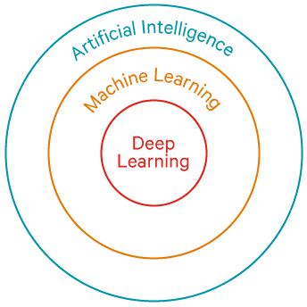

# 인공지능 개요
## 1. 인공 지능? 머신러닝? 딥러닝?
### 1.1 인공 지능이란?
인공 지능은 1950년대 초기 컴퓨터 과학 분야의 연구자들이 "컴퓨터가 _생각_ 할 수 있는가?" 라는 질문을 하면서   
시작되었습니다. 간단하게 이 분야를 정의하면 _보통의 사람이 수행하는 지능적인 작업을 자동화하기 위한 연구활동_ 이라고
표현할 수 있습니다. 즉 AI는 머신러닝과 딥러닝을 포괄하는 종합적 분야라고 할 수 있습니다.  
  
초기에 많은 전문가들은 _명시적 규칙_ 의 나열로 지식을 다룸으로 인간 수준의 인공 지능을 만들 수 있다고 생각했습니다.  
이런 접근 방법을 _심볼릭 AI(symbolic AI)_ 라고 합니다. 이러한 방식은 잘 정의된 논리적인 문제의 해결에는 적합했습니다.  
하지만 분류, 인식, 번역과 같은 고차원의 문제로 갈수록 문제해결을 위한 규칙을 찾기는 점점 어려워졌고 이러한 한계로부터   
심볼릭 AI를 대체하기 위한 새로운 방법이 등장했습니다.  
이것이 바로 _머신 러닝_ 입니다.   

### 1.2 머신 러닝이란?
머신러닝은 이런 질문에서 시작됩니다. '컴퓨터가 프로그래밍된 규칙 대신 데이터를 보고 자동으로 규칙을 학습할 수 있을까?'  
머신 러닝에서 규칙은 프로그래밍되는 것이 아니고 _훈련_ 됩니다.   
어떤 작업과 관련 있는 많은 샘플들을 제공하면 이 데이터들로부터 해당 작업을 자동화하기 위한 규칙을 만들어 냅니다.  

머신 러닝 알고리즘에 대해 조금 더 자세히 알아봅시다.  
머신러닝을 위해선 다음과 같은 세 가지가 필요합니다.  
+ 입력 데이터 (X)
+ 기대 출력 (Y)
+ 알고리즘의 성능 측정 방법 (for Feedback) 

머신 러닝 모델은 입력 데이터를 의미 있는 출력으로 변환합니다. 즉 머신 러닝은 입력 데이터를 기반으로 기대 출력에 가깝게  
만드는 _표현(representation)을 설정한 알고리즘 성능 측정법을 이용해 학습하게 됩니다. 

그러나 머신 러닝이 데이터를 유용한 표현으로 바꾸는 변환 또한 혼자서 찾아내는 것은 아닙니다.  
머신 러닝은 _가설 공간_ 이라 부르는 미리 정의된 연산의 모음들을 자세히 조사하는 것 뿐입니다.  
다시 말해 기술적으로 머신 러닝은 '__가능성 있는 공간을 사전에 정의하고 피드백 신호의 도움을 받아 입력 데이터에 대한     
유용한 변환을 찾는 것__' 이라 할 수 있습니다.   
함수 관점에서는 X를  Y에 매핑하는 방법을 알아내는 것 정도로 설명할 수 있겠습니다. 

### 1.3 딥러닝이란?
딥러닝은 머신 러닝의 특정한 한 분야로, 기본 _층(layer)_ 을 겹겹이 쌓은 _신경망(neural network)_ 라는 모델을 사용해   
표현 층을 학습합니다. 연속된 층에서 점진적으로 의미 있는 표현을 배우는 데 강점이 있습니다. 최근의 모델들은 표현 학습을 위해 수십, 수백의 연속된 층을 가지고 있습니다.  
층을 통과할수록 최종출력에 대해 점점 더 많은 정보를 가지지만 원본과는 다르게 변환되어 갑니다.  
이런 관점에서 보면 정보가 연속된 필터를 통과하며 순도 높게 정제되는 다단계 정보 추출 작업 정도로 생각할 수도 있겠습니다.

  

