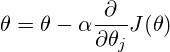

# 인공 신경망의 발전  
## 초기 인공신경망의 문제점  
MLP(Multi Layer Perceptron)은 인공신경망의 기원이지만 초기에 몇가지 문제점이 있었습니다.  
이 문제점들을 해결할 알고리즘이나 방법들이 나오고 나서야 비로소 딥러닝의 틀이 갖춰졌다고 말할 수 있겠습니다.  
본 문서에서는 해당 문제점들과 그 해결방안들에 대해 간단히 알아보겠습니다.

### 1.1 MLP의 학습방법?  
단일 층의 퍼셉트론이 아닌 여러개의 층으로 구성된 MLP를 이용하면 비선형적인 문제를 풀 수 있다는 것까진 알 수  
있었습니다. 하지만 당시에 MLP를 학습시킬 방법까지 찾아내진 못했습니다. 좀더 자세히 설명하자면 은닉층의 노드들은    
목표값이 없으므로 학습이 불가능하다고 생각되었습니다. 즉 가중치의 갱신방법을 찾지 못했던 것입니다.  
이로 인해 인공지능 분야는 다시 한동안 불황을 겪습니다.   

### 1.2 오류역전파(Back propagation) 알고리즘의 등장  
층이 여러개인 인공신경망을 학습시키는 방법에 대한 문제는 데이빗 럼멜하트(David E. Rumelhart)가 오류역전파 알고리즘을  
제안하면서 해결되었습니다.  

#### 1.2.1 경사하강법
오류역전파 알고리즘에 대해 설명하기 전 먼저 경사하강법에 대해 간단하게 설명하도록 하겠습니다.  
여러분도 아시다시피 미분가능한 함수가 주어지면 이론적으로 이 함수의 최솟값을 해석적으로 구할 수 있습니다.  
함수의 최솟값의 후보들은 변화율이 0인 지점에 있으므로 이 점들을 조사하면 됩니다.  
조금 다르게 생각해봅시다.  
여러분이 지금 평면 위 y에 대한 x의 함수의 어떤 한 점에 위치해 있다고 가정하고, 최솟값의 점으로 이동해야   
한다고 생각해봅시다. 어떻게 해야할까요?  
정답은   
1.우선 여러분이 지금 위치한 점에서 함수의 기울기를 구하고,  
2.그 기울기가 양이라면 x축의 음의 방향으로, 음이라면 x축의 양의 방향으로 나아가야할 것입니다.   
이 두 과정의 반복으로 여러분은 결국 최솟값에 도달할 것입니다.      
  

수식으로 표현한다면 다음과 같이 나타낼 수 있겠습니다.       
   

#### 1.2.2 오류역전파    
경사하강법의 개념을 똑같이 신경망에 적용해 봅시다.  
우리의 목표는 오차함수를 최소화하는 가중치의 조합을 찾는 것입니다.  
따라서 오차함수를 가중치에 대해 미분하고 그 값에 따라 가중치의 조정방향을 알 수 있을 것입니다.  
앞선 문서에선 퍼셉트론의 활성화함수 예시로 계단함수를 사용하였지만(실제로 초기의 퍼셉트론은 계단함수를   
활성화 함수로 썼습니다.), 계단함수는 미분이 불가능하므로 경사하강법을 적용할 수 없습니다.  
따라서 MLP로 넘어오면서 활성화함수로 계단함수를 미분 가능하도록 곡선화한 __sigmoid__ 함수를 사용합니다.  
수식은 아래와 같습니다.
    

앞서 말했듯이 은닉층은 목표값이 주어질 수 없기에 최종노드 층에서 구한 오차를 이용해야합니다.  
고로 오류역전파는 사실상 두 가지 단계로 이루어져 있습니다.  
1.입력의 학습벡터를 신경망을 통과시켜 오차를 구해내는 __순전파(Forward Propagation)__  
2.오차를 역으로 전파해서 가중치를 계산하는 __역전파(Back Propagation)__   
역전파 과정에서 __Chain Rule__ 을 이용하여 그래디언트를 계산하게 됩니다.  

### 2.1 Vanishing Gradient Problem  
오류 역전파 알고리즘을 이용해 층이 많아진 신경망을 학습시킬 수 있다는 것을 알게 되었지만,  
실제로 이대로 학습을 시작하면 큰 문제점이 발생합니다.  
역전파 과정에서 Chain Rule을 이용한다는 사실에 주목하면, sigmoid 함수를 미분한  
값을 계속 곱해나간다는 사실을 알 수 있습니다.   
2~3개 정도의 Layer까진 문제 없이 작동하더라도 레이어를 더 깊게 쌓는다면 문제가  
발생하기 시작합니다. 층이 늘어나면서 기울기가 중간에 매우 작아져 0에 수렴하는 기울기 소실   
(Vanishing Gradient)입니다.  
Sigmoid 함수를 미분한 형태는 다음과 같습니다.  
  
미분값이 0 ~ 0.25 사이임을 고려한다면 레이어를 깊게 쌓는다면 기울기가 점점 0에 수렴함을  
알 수 있습니다. 따라서 끝단의 레이어는 학습이 이루어지는 반면, 초기의 레이어들은 학습이 이루어지지 않는  
문제점이 발생합니다.   
   

  
### 2.2 ReLU (Rectified Linear Unit)    
Vanishing Gradient를 해결하기 위한 방법으로 나온 것이 다른 활성화 함수를 쓰는 것입니다.  
ReLU는 시그모이드 계열과는 다른 활성화 함수입니다. 입력이 0 이상이면 입력을 그대로 출력하고,  
0이하라면 0을 출력하도록 만들어진 함수입니다.   
ReLU 함수는 다음과 같은 특성을 가집니다.
+ 0 이상인 곳에서는 수렴하는 구간이 없다.
+ 단순히 입력값을 그대로 출력으로 내보내기에, 계산속도가 빠르다.  
+ 0 이상인 구간은 미분값이 1이고, 0 이하인 구간은 미분값이 0이다.
  

#### 2.2.1 Dying ReLU  
Vanishing Gradient 문제를 해결하고자 활성화 함수를 ReLU로 대체하는 방법을 도입했다고 말씀드렸습니다.  
그런데 뭔가 이상하지 않나요?  
ReLU 함수를 살펴보면 0보다 큰 값에서는 미분값이 1이지만, 0보다 작은 값에서 gradient가 또 0이라는   
문제가 발생합니다. 이것이 _Dead ReLU_ 문제이며 Weight들이 갱신되지 않는 문제가 발생하게 됩니다.  

#### 2.2.2 Modifying ReLU  
ReLU 함수 또한 Vanishing Gradient 문제를 완벽히 해결한 것은 아니였습니다.  
단지 어느정도까지 그 영향을 줄였다고 볼 수 있습니다.   
사람들은 이 문제를 극복하기 위해 ReLU함수를 조금씩 변형한 함수들을 활성화 함수로 쓰기 시작했습니다.  
그 다양한 예시가 밑의 그림입니다. (왼쪽이 활성화 함수, 오른쪽은 CIFAR10에 대한 Training loss이 변화입니다.)      
    

    

