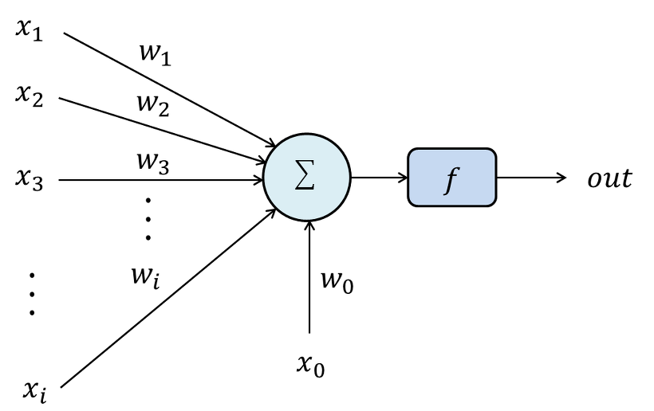
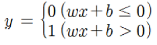
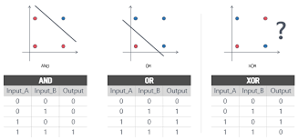
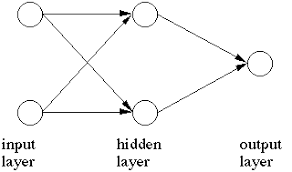

# 인공 신경망
## 1.퍼셉트론(Perceptron)과 XOR 문제
인간의 신경망이 뉴런들의 집합인 것처럼, 인공 신경망도 기본 단위의 집합으로 나타냅니다.  
인공 신경망의 기본 단위가 바로 _퍼셉트론(Perceptron)_ 입니다.  
퍼셉트론의 개념과 그 한계를 알아봅시다.
 
### 1.1 퍼셉트론(Perceptron)이란?
퍼셉트론은 Frank Rosenblatt이 고안한 개념으로, 다음과 같이 그림으로 표현할 수 있습니다.  
  

보시다시피 뉴런이 외부로부터 자극을 받아 임계치(역치)를 넘으면 신호를 전달하는 것처럼 퍼셉트론도 비슷하게 동작합니다.  
입력값 X에 가중치 W를 곱한 뒤 편향(bias) b를(W_0*X_0) 더한 값을 활성화 함수 f에 대입해 출력을 내보내게 됩니다.  
수식으로 표현하면 다음과 같습니다.  
(여기선 간단히 활성화 함수를 단위 계단 함수로 설정하겠습니다)    
   

### 1.2 한계
눈치가 빠른 분들은 이미 알아차리셨겠지만, 한 개의 퍼셉트론은 직선으로 나뉘는 두 영역을 만든다는 것을 출력의 형태로   
알 수 있습니다. 이것은 다시 말해 한 개의 퍼셉트론으로는 비선형적인 표현은 하지 못한다는 것을 의미합니다.  
여기서 유명한 XOR 문제가 나옵니다.  
인공지능 분야의 선구자였던 MIT의 마빈 민스키 교수가 1969년에 발표한 <Perceptrons> 논문에서 퍼셉트론이 비선형적 표현을  
나타내는 것은 불가능하며 이에 따라 간단한 XOR 문제도 못 푼다는 것이 밝혀졌습니다.  
_'뉴런 -> 신경망 -> 지능'_ 이라는 도식을 따라 _'퍼셉트론 -> 인공 신경망 -> 인공지능'_이 가능하리라 꿈꾸던 사람들은  
 좌절할 수 밖에 없었고, 이 논문 이후 인공지능 연구는 한동안 침체기를 겪게 됩니다.    
   

### 1.3 MLP(Multi Layer Perceptron, 다층 퍼셉트론)
아까 말했듯이 하나의 퍼셉트론, 단층 퍼셉트론(Single Layer Perceptron)으로는 할 수 있는 것의 한계가 명확해 보입니다.  
인공지능 학자들은 인공 신경망 개발을 위해 반드시 XOR 문제를 해결해야 했습니다.   
약 10년이 지난 후에야 이 문제가 해결되는데, 이를 해결한 개념이 바로 _다층 퍼셉트론(Multilayer Perceptron)_ 입니다.  

기존의 단층 퍼셉트론은 입력과 출력층만이 있었지만 다층 퍼셉트론은 입력층과 출력층 중간에 _'은닉층(Hidden Layer)'_ 가  
존재합니다. 이 은닉층의 존재로 인해 기존의 단층 퍼셉트론으로는 불가능했던 비선형적 표현이 가능해졌습니다.   
그리고 이것이 인공신경망의 기원입니다.  
   

  

  
 

